# Bluedi Pedal Controller

A physical MIDI pedal controller to control DAWs (music production software like *Cubase*), incorporating the HUI protocol for bidirectional communication. That features allows it to display track names and playing status on an LCD Display.

Note: Developed & Tested only in *Cubase 7*.

## Contents

- [Background](#background)
- [Implementatioon](#implementation)
	- [Microcontroller: *Teensy 3.2*](#microcontroller-teensy-32)
	- [Bidirectional Communication](#bidirectional-communication)
		- [Controller to DAW](#controller-to-daw)
		- [DAW to Controller](#daw-to-controller)
			- [The HUI Protocol](#the-hui-protocol)
	- [Building](#building)
	- [Software](#software)

## Background

I'm a hobbyist guitar player. I'm used in playing and recording through my sound card using my computer and VST effects on my DAW. I don't own any good pedals or amplifiers and I like my effect heavy sound chain. It would take thousands to create a physical pedal board and still it'd be a mess trying to manage settings between songs. Multieffects would be a solution but quality ones also cost thousands and need an external controller. I rarely (or not at all) play live or jam with friends but I'd like the possibility to use my current rig on a live setup.

After seeing plenty of projects that inspired me, the idea shined! A midi pedal controller! A way to control my virtual computer rig using pedal buttons (or switches) that I can create and configure the way I want! A nice hardware and software project with microcontrollers, protocols, etc!

Projects that inspired me:

- [Arduino MIDI Footswitch](https://www.youtube.com/watch?v=_wGipiYoeMQ) by @kapcom01
- [How to Make an Arduino MIDI Footswitch
](https://www.youtube.com/watch?v=M25I58I7BtI) by @HackerShackOfficial

So I made blueprint sketch of what I'd roughly like to build:

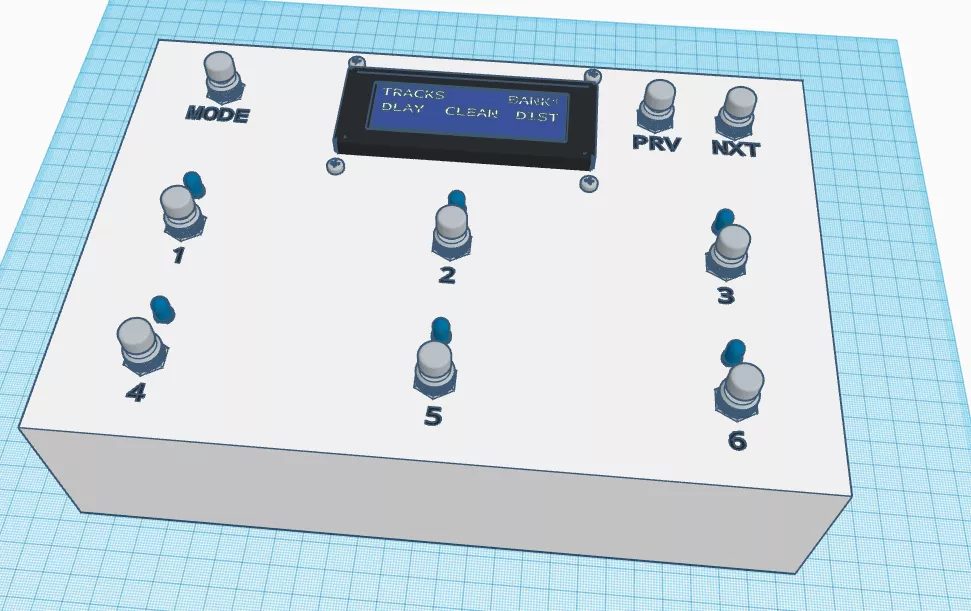

## Implementation

I'm kind of but not that much used to this kind of projects and I wasn't confident enough. So I first made plans and evaluated the cost for the parts which was around 100€. I decided to first buy the microcontroller and one stomp switch, combined with an old LCD display I already had, to make some tests and develop a prototype. If my research was conclusive I'd proceed to buy the rest parts needed to complete the project.

### Microcontroller: *Teensy 3.2*

Based on other projects I saw online and without any extended experience with microcontrollers [*Teensy 3.2*](https://www.pjrc.com/store/teensy32.html) came up as the best option. This thing can be easily used to **imitate a variety of USB devices** and be instantly recognized (plug n play) from a computer. **The options include MIDI Device** (as well as audio device, keyboard, mouse, joystick and other). 

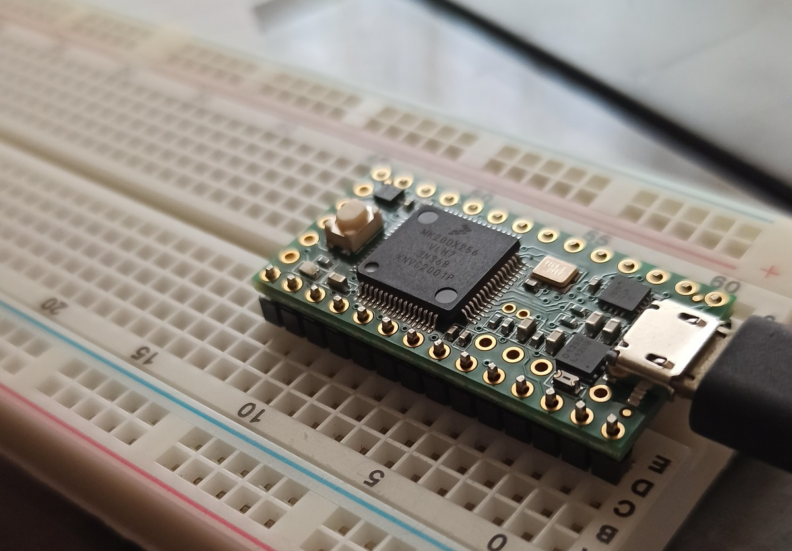

It also has plenty of input and output pins (both digital and analog) and some of them can be combined into ports (Serial, I2C, SPI) and used with code libraries to easily interface devices (like an LCD Display). Programming-wise, it's fully compatible with the *Arduino* toolchain and libraries. Last but not least it's more powerfull (on processing, ram and rom) than an *Arduino Uno*. And all of that in pretty reasonable price. Note: It's not my intention to promote *Teensy* but to offer my honest opinion as a satisfied customer (one with limited experience though). So take my words with a grain of salt.

###  Bidirectional Communication

All projects I saw included only Controller to DAW communication through MIDI. That means the controller worked like a keyboard to send MIDI commands to a computer. I'd like to have some feedback from the DAW (like track names or playing/recording status) and display it on an LCD Display.

#### Controller to DAW

I wanted to make the controller flexible enough to perform any action possible. It became clear that I shouldn't map every stomp switch to a fixed MIDI Command. A stomp switch could trigger an event/action that could send multiple MIDI commands if needed. Moreover, in future I could make multiple operational modes, so based on current mode, the buttons would perform diferrent actions (like DAW controller mode / Guitar Rig VST controller mode).

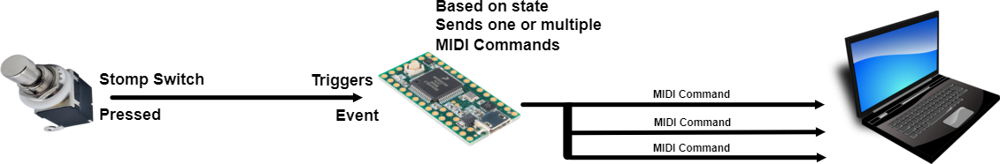

#### DAW to Controller

As mentioned above, that's something a few other people went into. There was hardly any info available online. After days of research I found about the **HUI protocol**. That protocol is based on MIDI and was made for commercial controllers like [these](https://mackie.com/en/products/controllers/mcu-pro-and-xt-pro) so they could communicate to DAWs in a way that the controllers could also get feedback (like track names, track statuses, fader positions, playing/recording status) from the DAW. That's not an open protocol but a commercial one (there is no public documentation available). 
I was lucky enough to find [this](https://forum.cockos.com/showthread.php?t=101328) post. That's the hard work of reverse engineering (trying to find out how things work) of a person nicknamed ***theageman***, that a person nicknamed ***Guido*** found and posted online. I'd like to pay my tributes to them. This information is enough to make a device that reads DAW info, as long as the DAW supports HUI controllers (and most of them do).

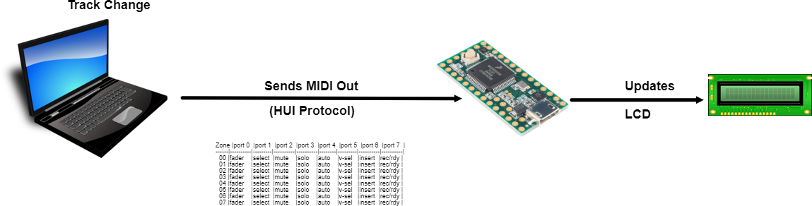

##### The HUI Protocol

Based on the data found in the resources mentioned above, I used what I needed for the project. It's important to note that the HUI Protocol is solely hardware oriented. That means that most commands target on specific hardware on the controllers surface that needs to be updated (like leds, lcd display, knobs, faders, etc).

First target was to retrieve which track is selected (and maybe which tracks if any are muted). The HUI protocol uses MIDI CC commands and a multiplexing table in order to indicate which control surface's leds should turn on or off. The table has 8 columns named as ports and its rows are named as zones. The first 8 zones correspond to the first 8 tracks of the DAW. To control a led, the DAW will first send the zone as a MIDI CC command. The Control Number of that command will be 0x0c and the Control Value will determine the selected zone. Then to select the port a MIDI CC command with Control Number = 0x2c will be sent. The Control Value of that command (in hex) will have the following format 0xQP where:

P = the port and 

Q = 4 to turn on the led or 0 to turn off the led

Zone |port 0  |port 1  |port 2  |port 3  |port 4  |port 5  |port 6  |port 7  |
-----|--------|--------|--------|--------|--------|--------|--------|--------|
  00 |fader   |select  |mute    |solo    |auto    |v-sel   |insert  |rec/rdy |
  01 |fader   |select  |mute    |solo    |auto    |v-sel   |insert  |rec/rdy |
  02 |fader   |select  |mute    |solo    |auto    |v-sel   |insert  |rec/rdy |
  03 |fader   |select  |mute    |solo    |auto    |v-sel   |insert  |rec/rdy |
  04 |fader   |select  |mute    |solo    |auto    |v-sel   |insert  |rec/rdy |
  05 |fader   |select  |mute    |solo    |auto    |v-sel   |insert  |rec/rdy |
  06 |fader   |select  |mute    |solo    |auto    |v-sel   |insert  |rec/rdy |
  07 |fader   |select  |mute    |solo    |auto    |v-sel   |insert  |rec/rdy |

Second target was to retrieve the track names. This is done by MIDI SysEx commands. The MIDI SysEx payload for LCD Display updates with 4 characters for each track name has the following format (in hex):

0xf0 0x00 0x00 0x66 0x05 0x00 0x10 0xTT 0xPP 0xQQ 0xRR 0xSS 0xf7

where:

TT = the track number (if it's 0 to 7) and

PP,QQ,RR,SS = the four channel characters

That way you can retrieve a 4character name for each of the first 8 tracks of the DAW.

Keep in mind that I followed a very specific approach on my code, based on my DAW's (Cubase 7) support of external controllers. Most DAWs offer support to a variety of external controllers including legacy ones but I have absolutely no clue about exact support on every DAW and its versions.

Anyway...

So to wrap it up, I chose to use simple MIDI commands for output and the HUI Protocol Commands for input.

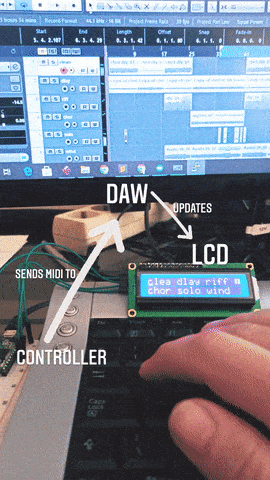

### Building

With a working prototype complete I was confident enough to order the rest of the parts needed. For the case I used a hard plastic project box case. With the help of my dad (thanks dad), holes for the stomp switchs, leds and lcd display were drilled.

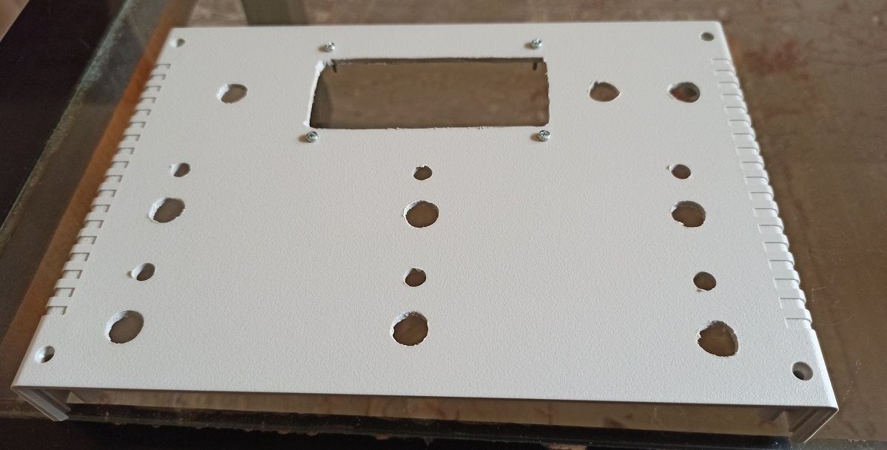

I then mounted the stomp switches which is pretty straight-forward, as long as your holes have the correct diameter (^^) (the diameter mentioned by the manufacturer) and the lcd display.

To mount the leds I used plastic led holders. They are pretty cheap, easy to use and yet add value and a professional touch, as opposed to using glue that would look messy and ugly.

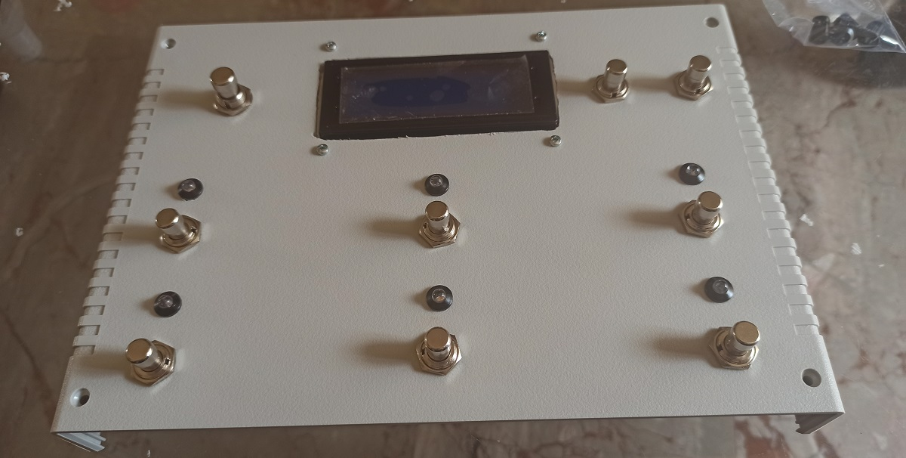

Now some wiring and soldering (I really suck at those). It came as easier for me to start with the common ground (connect all parts' ground pins together and that to microcontroller's ground pin). I used brown colored hard wire. Then I directly soldered appropriate resistors on the leds (maybe I could use some higher value / my leds came out very bright). Well, I could have grounded the leds through the resistor (as it doesn't matter where the resistor goes).

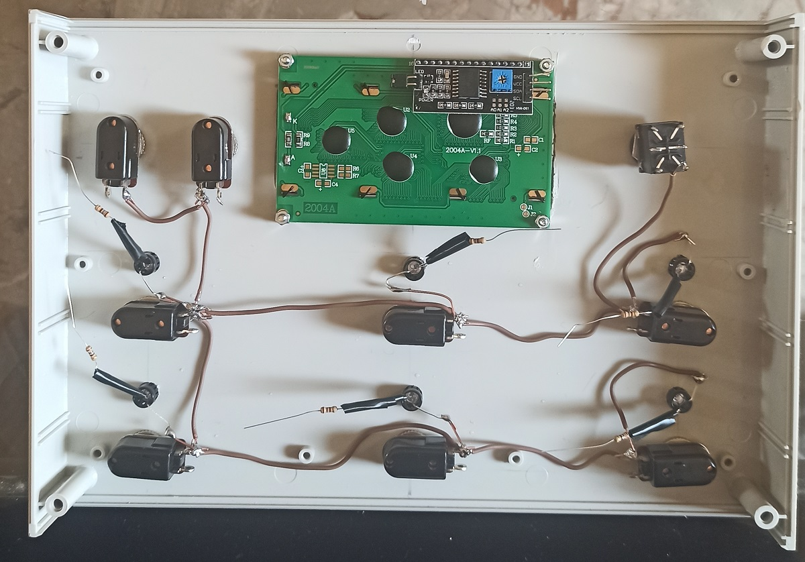

So now every other pin on my stomp switches and leds could be directly connected to a digital pin on my microcontroller. *Teensy* has plenty of pins so I didn't use multiplexing (that led to having to many cables though). I used green colored wires for leds (to output pins) and red colored wires for stomp switches (to input pins). 

I had to make some soldering corrections (as a couple points broke loose) and used some plastic tape to arrange the cables.

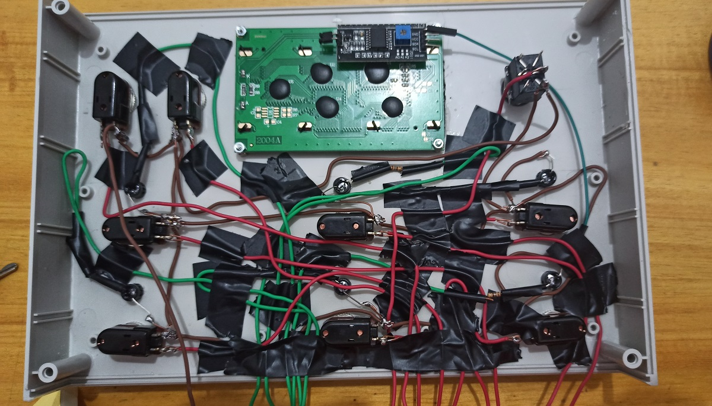

To connect incoming cables and mount my microcontroller inside the box I used a screw terminal base for *Arduino Nano*. I found out it's roughly the same size (the base has some extra pins) and exactly same pin distance. Also pin names on the board are different. Something important to note here though is that there were 2 ground pins which were connected and I had to take that into consideration.

In order to connect the controller to my computer for both programming and using a usb midi device, I used a micro usb extension cable (male to mountable female). For future use I also mounted and connected a socket for stereo 6.35mm jack, so I could use a volume pedal with the controller to control parameters like wah, volume, pitch etc.

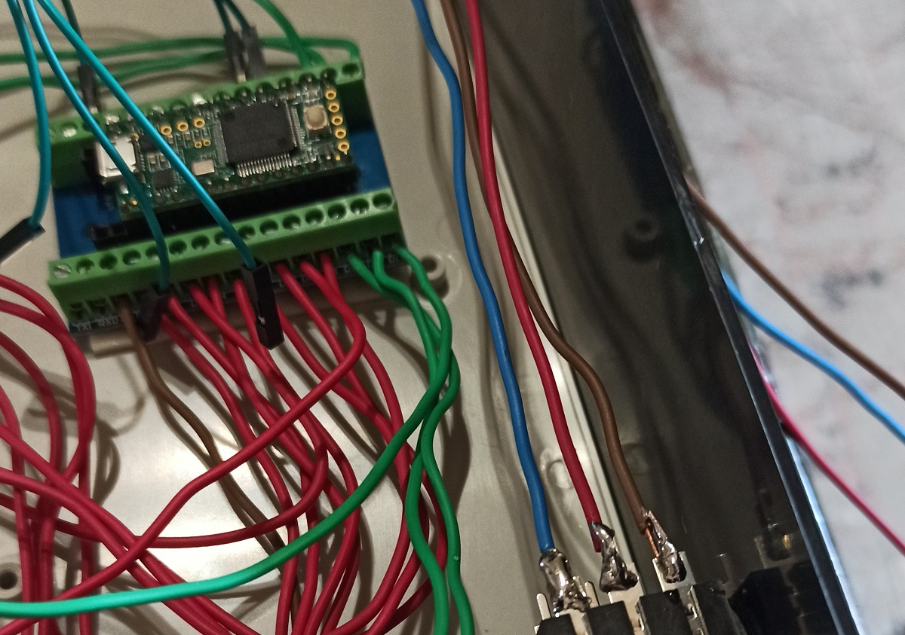

The final step was closing the box. 

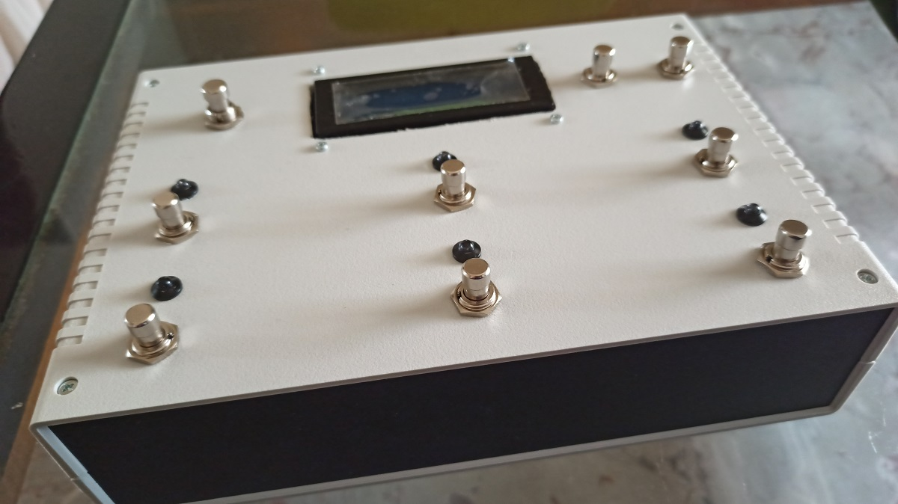

### Software

Coding was done in C++ and made inside the *Arduino IDE*. For LCD display control I used the [*hd44780_I2Cexp*](https://github.com/duinoWitchery/hd44780) library. For LED control I used the [*JLed*](https://github.com/jandelgado/jled) library. For better Stomp Switch managing (like debouncing and extended events like double tap) I used the [*ButtonEvents*](https://github.com/fasteddy516/ButtonEvents) library. For MIDI io I used the [internal MIDI library](https://www.pjrc.com/teensy/td_midi.html) which is included when MIDI is selected as USB type on *Arduino IDE*.

To better organize the code I created 6 singleton classes:

- **DawStatus**
	
	Keeps status info of DAW

- **DawInput**
	
	Manages MIDI input from DAW, decrypting HUI protocol commands

- **DawOutput**
	
	Provides MIDI output methods to DAW

- **LcdController**
	
	Provides LCD Display output functionality

- **BtnController**
	
	Provides Stomp Switch status

- **LedController**
	
	Manages LEDs

